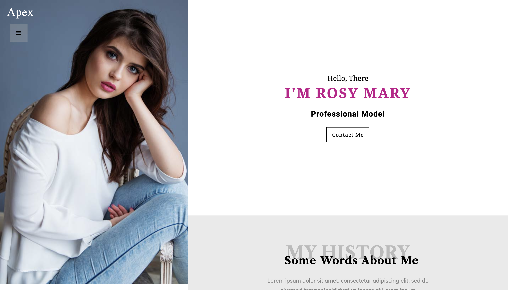

# apex-web

This project is a landing page of a website i wanted to make this one for practicing my flexbox.

This landing page was made with:
  - [html](https://www.w3schools.com/html/)
  - [css](https://www.w3schools.com/css/default.asp)
  - [bootstrap](https://getbootstrap.com/)
  - [font-awesome](https://fontawesome.com/)
  - [google fonts](https://fonts.google.com/)
  
***

 -  Beautiful landing page made with flexbox.
 -  It was a good practice for flexbox.

***

